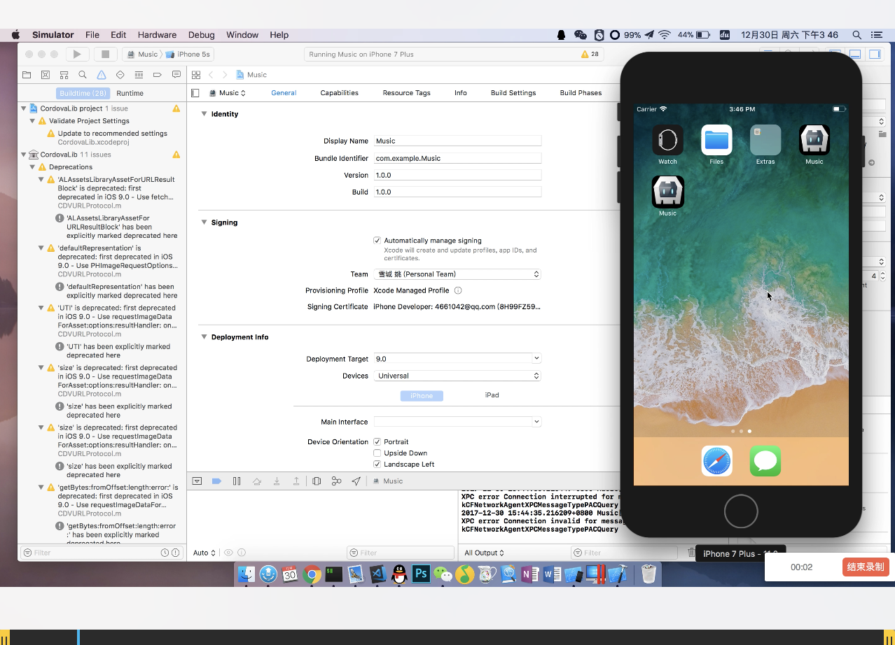

# QQ 音乐 WebApp


## 介绍

该项目来源[HuangYi](https://github.com/ustbhuangyi), 之前写过他的[eleApp](https://github.com/forzeny/eleApp),后来发现这个音乐App，可惜未开源，还好他的学生把这个项目开源了，所以就有了这个仓库，后面回提到我的一些改进。

17年7月毕业，之前实习接触过React和Ng，毕业后来到的这家公司使用Vue，上手就是维护Vuex项目，但是感觉老项目代码写的不是很好，所以就准备找几个好的项目来学习所以就有了[eleApp](https://github.com/forzeny/eleApp)和本项目

数据来源QQ音乐JSONP，部分接口存在http header的限制所以用到了node，托管于VPS，PM2 部署，Nginx代理，

[演示地址](http://45.77.79.163/Music)

[备用：项目演示地址 GitHub Pages](https://forzeny.github.io/Music-Player/music/#/recommend)

## 耗时

20171013 - 至今

## 平台

* macOS High Sierra
* vscode

## 相关

* Vue @2.3.3, vue-router, vuex, axios
* less (太习惯stylus所以我还是继续使用less了)
* ES6
* Express
* ~~~lib-flexbile~~~ amfe-flexible@2.0,  px2rem

* Vultr PM2 Nginx

## 分支

* master
* [lib-flex](https://www.npmjs.com/package/amfe-flexible) 添加自适应布局 merge into master √
* [ssr](https://ssr.vuejs.org/en/) 服务端渲染实现
* [pre-render](https://github.com/chrisvfritz/prerender-spa-plugin) 预渲染实现

## 组件

* 基础组件：确认对话框，loading，进度条，开关切换，搜索框，滚动组件，消息提示组件等
* 业务组件：添加歌曲到列表，歌单详情，播放内核，搜索页面，用户中心，顶部导航，排行榜等组件
* 上拉刷新，函数防抖动搜索，消除点击延迟，异步路由

## 已完成部分

* [x] /recommand 推荐页：轮播图，推荐歌单列表
* [x] /singer 歌手页列表：歌手列表展示，左右联动，快速入口，类似通讯录
* [x] /singer/:id 歌手详情页：局部滚动，视差，播放音乐，音乐播放器有的功能都有
* [x] /rank/:id 排行页：同上
* [x] /search 搜索：搜索结果，搜索历史，热门搜索，结果播放
* [ ] 播放列表页：当前播放队列
* [ ] 用户中心页：

## 调试工具

* vConsole
* Charles

## 注意事项

* animation-play-state: paused ios 不支持[解决方案](https://codepen.io/HaoyCn/pen/BZZrLd)
* min-player [进度条实现](https://codepen.io/xgad/post/svg-radial-progress-meters)
* vue@2.5+  [ios 不能播放问题](https://github.com/DDFE/DDFE-blog/issues/24)

## 本地预览

```bash
git clone hhttps://github.com/forzeny/Music-Player.git
$ cd Music-Player
$ yarn install
$ yarn run dev
```

## 改进及优化

* QQ音乐UI
* 适配优化
* 打包优化

### 打包

* 分块（根据打包后的[分析报告](https://www.npmjs.com/package/webpack-bundle-analyzer)进行优化）
* 主要处理vendor，一般都是这部分体积大，相关类库一般不会变化，所以单独打包并加上时间戳辨别文件是否变化，同时把manifest抽离出来，保证manifest变化不影响vendor变化导致缓存失效
* 采用组件懒加载
* 部分图片处理为base64编码形式

### 适配

* 多端同构webApp, native, Hybrid采用 [amfe-flexible@2.x](https://www.npmjs.com/package/amfe-flexible) （相比以前的版本我更倾向于2.x）配合px2rem

* IOS的Safari浏览器和微信webview打包前后兼容性问题，此应用未调用设备API

* 以下图片为打包后软件运行图，不能后台播放需要IOSER帮助，真机上动画流畅

#### IOS 适配

* iphoneX 真机截图 上下有留白


* IOS系列模拟器正常





#### Andriod 适配

试了下腾讯的[weTest](http://wetest.qq.com/product/cloudphone?from=default_automail_new) 收费，没继续用
